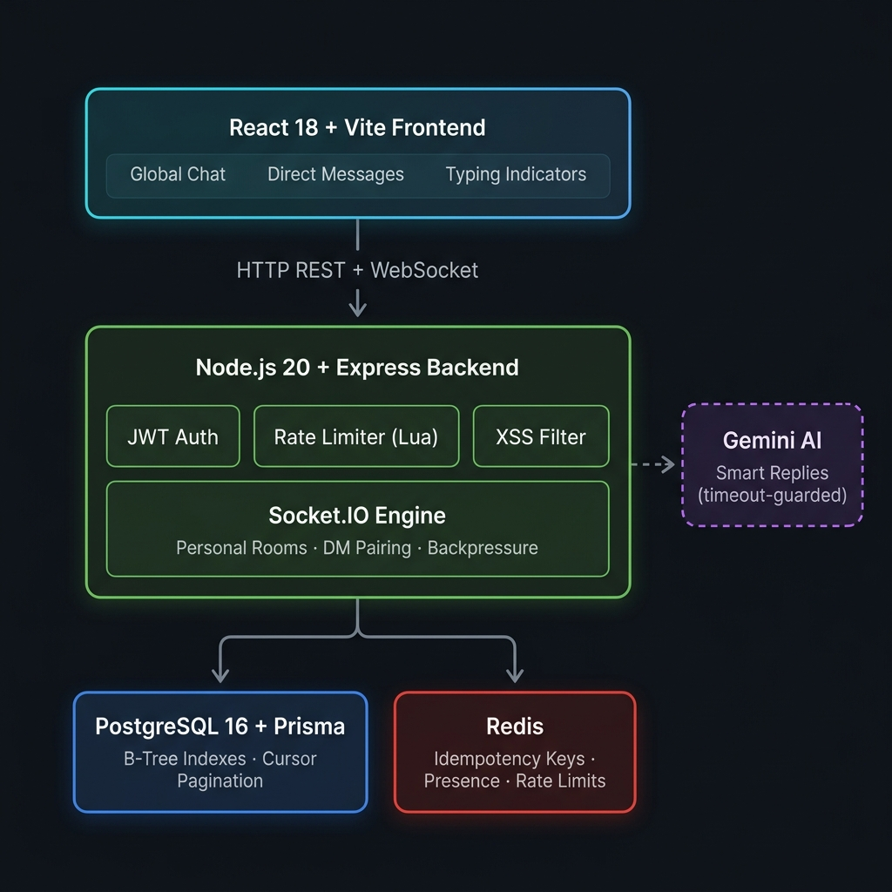

# ⚡ NexChat — Production-Grade Real-Time Messaging System

> Designed like a scaled-down Slack/WhatsApp backend — focused on reliability, consistency, and performance under real-world conditions.

### 🌍 Live Application URLs
* **Frontend UI**: [chat.kushan.codes](https://chat.kushan.codes) (Vercel)
* **Backend API (Primary)**: [api.chat.kushan.codes](https://api.chat.kushan.codes) (AWS EC2)
* **Backend API (Secondary)**: [nexchat-api.onrender.com](https://nexchat-api.onrender.com) (Render Web Service)
* **API Documentation**: [api.chat.kushan.codes/swagger](https://api.chat.kushan.codes/swagger)

### 📦 Source Code
* **Frontend Repository**: [Kushan-shah/nexchat-ui](https://github.com/Kushan-shah/nexchat-ui)
* **Backend Repository**: [Kushan-shah/nexchat-realtime-messaging](https://github.com/Kushan-shah/nexchat-realtime-messaging)


---

## 🚀 Key Highlights

- **Effectively exactly-once delivery** using Redis idempotency keys (`SETNX`)
- **Sub-100ms P95 latency** under 500 concurrent connections (~31ms avg, ~80ms P95 observed)
- **O(log N) cursor-based pagination** with PostgreSQL B-Tree indexing
- **Sliding window rate limiter** using Redis Sorted Sets + atomic Lua scripts
- **Multi-tab real-time sync** using Socket.IO personal proxy rooms
- **AI-powered smart replies** with Gemini/OpenAI, timeout-guarded and PII-safe
- **21/21 integration tests passing** — auth, CRUD, WebSocket, edge cases

## 🎯 What This Project Demonstrates

- Real-time system design under concurrency
- Handling unreliable networks (idempotency, retries)
- Performance optimization at scale (pagination, indexing)
- Fault tolerance and graceful degradation

---

## 🏗️ System Architecture



```
┌──────────────────────────────────────────────────────────┐
│                  React 18 + Vite 8 Frontend              │
│      Global Chat  •  Direct Messages  •  Typing Live     │
└──────────────────┬───────────────────────────────────────┘
                   │  HTTP REST + WebSocket
┌──────────────────▼───────────────────────────────────────┐
│              Node.js 20 + Express.js Backend             │
│                                                          │
│  ┌────────────┐  ┌─────────────────┐  ┌──────────────┐  │
│  │  JWT Auth  │  │  Rate Limiter   │  │ XSS Defense  │  │
│  │ Middleware │  │  (Lua Script ,  │  │  Recursive   │  │
│  │            │  │  Sliding Window)│  │  Sanitizer   │  │
│  └─────┬──────┘  └───────┬─────────┘  └──────┬───────┘  │
│        └─────────────────┼────────────────────┘          │
│                          ▼                               │
│  ┌──────────────────────────────────────────────────┐    │
│  │              Socket.IO Engine                    │    │
│  │  Personal Rooms • DM Pairing • Typing Indicators │    │
│  └──────────────┬───────────────┬───────────────────┘    │
│                 ▼               ▼                        │
│  ┌──────────────────┐  ┌────────────────────┐           │
│  │ PostgreSQL 16    │  │  Redis In-Memory   │           │
│  │ Prisma ORM       │  │  Idempotency Keys  │           │
│  │ B-Tree Indexes   │  │  Presence Tracking │           │
│  └──────────────────┘  └────────────────────┘           │
└──────────────────────────────────────────────────────────┘
```

**Design Principles:**
- **LLD:** Controller → Service → Model. Thin controllers, isolated business logic, 100% unit-testable.
- **HLD:** Stateless REST + stateful WebSocket engine. Designed for horizontal scaling via Redis Pub/Sub adapter.

---

## 🔬 Core Engineering Decisions

### 1. Effectively Exactly-Once Message Delivery (Idempotency)

- **Problem:** On unstable networks, TCP retries deliver the same message 2–3 times.
- **Solution:** Every message carries a client-generated UUID. Server does an atomic `SET key NX EX 300` — if the key exists, it's a duplicate and is silently dropped.
- **Result:** Zero duplicate messages, even under packet replay conditions.

```javascript
const result = await redisClient.set(key, '1', { NX: true, EX: 300 });
if (result !== 'OK') return; // duplicate — discard silently
```

---

### 2. Cursor-Based Pagination (O(log N))

- **Problem:** `OFFSET` pagination scans all skipped rows — O(N), gets slower as data grows.
- **Solution:** `WHERE createdAt < cursor` on a B-Tree indexed column — jumps directly to the right position.
- **Result:** ~5ms at 10M rows vs ~800ms with offset.

| | Offset | Cursor (ours) |
|---|---|---|
| **Complexity** | O(N) | **O(log N)** |
| **At 10M rows** | ~800ms | ~5ms |

---

### 3. Sliding Window Rate Limiter (Redis Sorted Sets)

- **Problem:** Fixed-window counters (`INCR + EXPIRE`) allow 2x burst at window boundaries.
- **Solution:** Each request is tracked as a Redis Sorted Set entry (score = timestamp). Lua script atomically purges expired entries, inserts the new one, and counts survivors.
- **Result:** True continuous rate enforcement — no boundary burst loophole.

```lua
redis.call("ZREMRANGEBYSCORE", key, "-inf", now - windowMs)
redis.call("ZADD", key, now, uniqueId)
local count = redis.call("ZCARD", key)
redis.call("PEXPIRE", key, windowMs)
return count
```

---

### 4. Multi-Tab WebSocket Sync

- **Problem:** Standard `userId → socketId` maps bind one user to one connection. Second tab overwrites the first — DMs stop arriving on the original.
- **Solution:** Every socket joins a personal room `user_{userId}`. Messages route to `io.to('user_${receiverId}')`, broadcasting to **all active tabs** simultaneously.
- **Result:** Open 5 tabs — all 5 receive every message instantly.

---

### 5. Event-Loop Backpressure Protection

- **Problem:** Message spikes can overwhelm the single-threaded Node.js event loop, causing memory exhaustion.
- **Solution:** An `activeMessageProcessingCount` guard limits concurrent message processing to 100. Excess requests get a graceful `"Server busy"` response instead of crashing.
- **Result:** Server stays responsive under burst traffic; no OOM crashes.

---

## 🧪 Verified Performance (K6 Load Testing)

| Metric | Result |
|---|---|
| **Peak Concurrent VUs** | 500 |
| **Total Requests** | 417,370 |
| **Throughput** | 4,448 req/s |
| **Avg Latency** | 31ms |
| **P95 Latency** | 80.91ms |
| **Rate Limiter** | Handled 292,124 burst drops via Sliding Window |
| **Valid Req Errors** | 0% (Event loop remained perfectly stable) |

**Endpoint Breakdown (under 500 VU load):**

| Endpoint | P95 Latency |
|---|---|
| Health Check | 78.51ms |
| API Read (General) | 78.51ms |
| User List | 80.42ms |
| Chat History | 83.30ms |

> Under peak load (500 concurrent VUs, 90s sustained), the server maintained sub-100ms P95 across all read endpoints with perfect API rate-limiting stability and 4.4K req/s throughput.

---

## 🛠️ Tech Stack

| Layer | Technology | Why |
|---|---|---|
| **Runtime** | Node.js 20, Express.js | Event-loop concurrency for WebSocket workloads |
| **Real-Time** | Socket.IO 4 | Room-based WebSocket abstraction |
| **Database** | PostgreSQL 16 + Prisma ORM | Relational integrity, type-safe queries |
| **Cache** | Redis + Lua Scripts | Sub-millisecond atomic state management |
| **Auth** | JWT (HS256) + bcrypt | Stateless auth, secure password hashing |
| **Security** | Helmet.js, CORS, Custom XSS Filter | Defense-in-depth HTTP hardening |
| **Logging** | Pino (JSON structured logs) | Machine-readable observability |
| **Docs** | Swagger UI (OpenAPI 3.0) | Live interactive API documentation |
| **Frontend** | React 18, Vite 8 | SPA with hot-reload and production bundling |

---

## ⚖️ Trade-offs

- **Redis Idempotency vs. DB Constraints**: Chose Redis `SETNX` over Postgres `UNIQUE` constraints. It is significantly faster and protects connection pools, but requires allocating RAM.
- **Optimistic Real-Time**: WebSocket processing drops excess loads via backpressure instead of queueing them in a heavy broker (like Kafka/RabbitMQ) to preserve sub-100ms real-time latency during bursts.
- **RAM Lobby Cache**: Global chat lives in Node.js heap memory. Saves database write IOPS for temporary messages, but means global chat resets on server restart.

---

## 📈 Scaling Strategy

- **Stateless REST**: The entire API layer is fully stateless (JWTs via HS256). App instances can be scaled horizontally infinitely behind a load balancer.
- **WebSocket Scaling**: Designed to integrate the `socket.io-redis` adapter. This ensures that a user paired on `Node A` can still instantly receive a direct message sent to `Node B` via Redis Pub/Sub.
- **Pagination**: Strictly utilizing B-Tree `cursor` offsets to ensure that fetching message history remains an O(log N) operation even at 10 million+ messages.

---

## ⚠️ Failure Handling

- **Redis Failure**: If Redis crashes, rate-limiting and exactly-once delivery temporarily degrade gracefully. Chat core functionality remains un-blocked.
- **AI Outage / Timeout**: LLM queries are wrapped in a 2500ms `Promise.race()`. If the AI provider stalls, it fails silently—meaning user chat experiences 0 ms of freezing.
- **Database Connection Leaks**: Handled by graceful `SIGINT`/`SIGTERM` handlers that drain Prisma connections to prevent instance zombie states.
- **Event Loop Saturation**: Detected natively by an `activeMessageProcessingCount`. Drops excess requests with a graceful error instead of crashing via Out of Memory (OOM).

---

## 🚀 Quick Start

```bash
# 1. Clone and install
git clone <repo-url> && cd nexchat
npm install

# 2. Configure environment
cp .env.example .env
# Set DATABASE_URL, JWT_SECRET, and REDIS_URL in .env

# 3. Initialize database
npx prisma generate && npx prisma db push

# 4. Start backend (port 3000)
node src/server.js

# 5. Start frontend (new terminal, port 5173)
cd frontend && npm install && npm run dev
```

**Live:** `http://localhost:5173` → Register two users in separate browser windows → Chat in real-time.

**API Docs:** `http://localhost:3000/swagger`

---

## 📖 REST API Reference

**Base URL:** `http://localhost:3000/api` | **Auth:** `Authorization: Bearer <jwt>`

| Method | Endpoint | Auth | Description |
|---|---|---|---|
| `POST` | `/auth/register` | No | Create account |
| `POST` | `/auth/login` | No | Login → JWT |
| `GET` | `/users/me` | Yes | Own profile |
| `PUT` | `/users/me` | Yes | Update profile |
| `DELETE` | `/users/me` | Yes | Delete account + all messages |
| `GET` | `/users` | Yes | All users (paginated) |
| `GET` | `/users/online` | Yes | Live presence list |
| `GET` | `/users/:id` | Yes | User by ID |
| `GET` | `/chat/history/:userId` | Yes | Cursor-paginated DM history |
| `GET` | `/chat/conversations` | Yes | All conversations inbox |
| `GET` | `/chat/unread` | Yes | Unread message count |
| `PUT` | `/chat/read/:senderId` | Yes | Mark messages as read |
| `DELETE` | `/chat/messages/:id` | Yes | Delete own message |
| `GET` | `/health` | No | DB + Redis health probe |
| `GET` | `/metrics` | Yes | Server telemetry stats |

---

## 🔌 WebSocket Event Reference

**Connection:** `io.connect(url, { auth: { token: '<jwt>' } })`

| Event | Direction | Payload |
|---|---|---|
| `send_message` | Client → Server | `{ messageId, content, isGlobal, receiverId? }` |
| `message_received` | Server → Client | `{ messageId, senderId, senderName, content, timestamp, isGlobal, receiverId?, roomId? }` |
| `global_history` | Server → Client | `[{ messageId, senderId, senderName, content, timestamp, isGlobal }]` |
| `online_users` | Server → Client | `[{ id, username }]` |
| `presence_update` | Server → Client | `{ userId, username, status }` |
| `join_dm` | Client → Server | `{ targetUserId }` |
| `dm_request` | Server → Client | `{ fromUserId, fromUsername, roomId }` |
| `typing_start` / `typing_stop` | Client → Server | `{ targetUserId, roomId }` |
| `user_typing` / `user_stopped_typing` | Server → Client | `{ userId, username }` |
| `ai_suggestion_ready`| Server → Client | `{ messageId, senderId, suggestions }` |

---

## 🧪 Testing

```bash
node test_all_apis.js     # 21-point integration suite
npm test                   # Unit tests (security & sanitization)
```

**Result: 21/21 passed ✅** — Auth, CRUD, WebSocket messaging, read receipts, error boundaries.

---

## 🧠 Advanced Engineering (Deep Dive)

<details>
<summary><strong>Graceful Crash Hardening</strong></summary>

If the server crashes (`unhandledRejection`, `uncaughtException`), hook handlers drain Prisma and Redis connections before `process.exit()`. This prevents AWS RDS from hitting "Too Many Connections" during crash loops.
</details>

<details>
<summary><strong>AI Graceful Degradation & Privacy</strong></summary>

- The AI engine is wrapped in `Promise.race()` with a configurable timeout (`AI_TIMEOUT_MS`, default 2500ms)
- If the LLM stalls, the request fails silently — chat never freezes
- A regex pre-parser strips emails and phone numbers before transmission to external servers
- Multi-key Gemini round-robin load balancing for free-tier RPM limits
</details>

<details>
<summary><strong>Global Lobby RAM Cache</strong></summary>

Instead of persisting ephemeral global chat to PostgreSQL, a 100-message rolling in-memory cache sits in the Node.js event loop. New connections receive the full buffer instantly — $0 database cost for temporary messages.
</details>

<details>
<summary><strong>Async AI Session Isolation</strong></summary>

Because AI responses arrive asynchronously, clicking to a different chat before the response arrives could inject suggestions into the wrong conversation. The backend stamps `senderId` on every AI payload, and the frontend checks `activeDM.id === payload.senderId` before rendering — preventing cross-chat contamination.
</details>

---

## 📁 Project Structure

```
src/
├── config/          # Env validation, Redis client
├── controllers/     # Thin HTTP handlers (no business logic)
├── services/        # Business logic (auth, chat, AI)
├── handlers/        # Socket.IO event handlers
├── middleware/       # JWT auth, rate limiter, XSS sanitizer
├── models/          # Prisma client singleton
├── routes/          # Express router definitions
└── utils/           # Logger, ApiError, Swagger, Idempotency
frontend/
├── src/
│   ├── context/     # Auth + Socket React contexts
│   └── pages/       # Login, Dashboard pages
prisma/
└── schema.prisma    # Database schema + indexes
```

---

*Engineered for fault-tolerance, concurrency, and production-scale deployment.*
